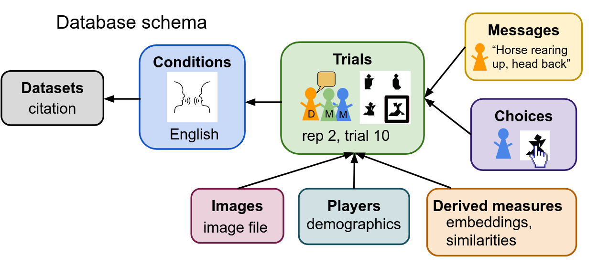

```{r setup, include = FALSE}
knitr::opts_chunk$set(
  fig.width = 6, fig.height = 3, fig.crop = F,
  fig.pos = "tb", fig.path = "figs/",
  echo = F, warning = F, cache = F,
  message = F, sanitize = T
)

library(tidyverse)
library(here)
library(brms)
library(rstan)
library(rstanarm)
library(ggthemes)
library(kableExtra)
library(tidybayes)
library(cowplot)
library(refbankr)
rstan_options(auto_write = TRUE)
options(mc.cores = parallel::detectCores())
theme_set(theme_bw())

### functions for printing things nicely!
stats <- function(model, row, decimal = 2) {
  model <- model |>
    mutate(
      Estimate = round(Estimate, digits = decimal),
      Lower = round(lower, digits = decimal),
      Upper = round(upper, digits = decimal),
      `Credible Interval` = str_c("[", Lower, ", ", Upper, "]")
    ) |>
    select(Term, Estimate, `Credible Interval`)
  str_c(model[row, 1], ": ", model[row, 2], " ", model[row, 3])
}

stats_text <- function(model, row, decimal = 2) {
  model <- model |>
    mutate(
      Estimate = round(Estimate, digits = decimal) |> formatC(format = "f", digits = decimal),
      Lower = round(lower, digits = decimal) |> formatC(format = "f", digits = decimal),
      Upper = round(upper, digits = decimal) |> formatC(format = "f", digits = decimal),
      `Credible Interval` = str_c("[", Lower, ", ", Upper, "]")
    ) |>
    select(Term, Estimate, `Credible Interval`)
  str_c(model[row, 2], "  ", model[row, 3])
}

form <- function(model_form) {
  dep <- as.character(model_form$formula[2])
  ind <- as.character(model_form$formula[3])

  str_c(dep, " ~ ", ind) |>
        str_replace_all(" ", "") |>
    str_replace_all("_id", "") |> 
    str_replace_all("_", " ") |> 
    str_replace_all("\\*", " $\\\\times$ ") |>
    str_replace_all("\\+", "&nbsp;+ ") |>
    str_replace_all("~", "$\\\\sim$ ")
}

mod_loc <- "cached_model_files/mods"


plot_preds <- function(df, dv){
  df <- df |> filter(rep_num<=6)
  ggplot() +
    geom_line(
      data = df |> filter(!is.na(dataset_id)),
      aes(
        x = rep_num, y = mean,ymin=low, ymax=high,
        group = interaction(condition_id)
      ),color="grey"
    ) +
    geom_ribbon(
      data = df |> filter(is.na(dataset_id)),
      aes(x = rep_num, y = mean, ymin=low, ymax=high),color=NA, fill="blue", alpha=.3) +
    theme(legend.position = "none")+
   geom_line(
      data = df |> filter(is.na(dataset_id)),
      aes(x = rep_num, y = mean, ymin=low, ymax=high),color="blue", linewidth=1) +
    theme(legend.position = "none")
}

plot_preds_pos <- function(df, dv){
  df <- df |> filter(rep_num<=6)
  ggplot() +
    geom_line(
      data = df |> filter(!is.na(dataset_id)),
      aes(
        x = rep_num, y = mean,ymin=low, ymax=high,
        group = interaction(condition_id, pos)
      ),color="grey"
    ) +
    geom_ribbon(
      data = df |> filter(is.na(dataset_id)),
      aes(x = rep_num, y = mean, ymin=low, ymax=high, fill=pos, group=pos),alpha=.3) +
    theme(legend.position = "none")+
   geom_line(
      data = df |> filter(is.na(dataset_id)),
      aes(x = rep_num, y = mean, ymin=low, ymax=high, color=pos, group=pos), linewidth=1) +
    theme(legend.position = "none")+facet_wrap(~pos)
}

```

# TODO list

* re-run all models (not that things will change much)
* confirm that dataset summary looks okay and that dataset inclusions look okay
* fix accuracy prediction plot -- should make sure the overall prediction line has some reasonable number of trials

* clean up model formula writing 

* what do to about reduction moderators ... we just have too many variables and conditions?

* figure out what floats we want
Relevant various places, but we should decide what the plots should be -- here is shown with model fits, both with per condition ranef and with overall (+95% CI).

* deal with refs/citations

* fix inconsisistent al versus al. in dataset refs
* clean up intro
* clean up "methods"/description
* clean up analyses
* write discussion
* write abstract
* write title?

# Intro

Language is used to communicate, and one of the flexible things about language is that it can be used to communicate about new concepts. ... One way convention formation and related language use phenomena are often studied is via iterated reference games (introduced by CITE Krauss and popularized by CITE Clark). 

## What are ref games?
Iterated reference games are a commonly used paradigm for studying adaptive language use. A *reference game* consists of a group of people communicating with each other about a set of potential referents. One person, the *describer*, has a specific designated target (usually pre-identified as the target by the experimenter) that they seek to communicate to the *matcher* (or matchers). This act of reference requires coordination between describer and matcher on a symbol--meaning alignment. *Iterated* reference games involve repeated reference to the same targets within the same group of people, so that a certain conversational history builds up that could shape the construction and understanding of later symbols. 

Communicative acts serve a variety of purposes, but a simple, yet central one is reference: connecting a symbol with a meaning to pick out a target. This is a subgoal needed for more complex acts -- it's hard to tell a story or debate someone without agreement on what different words or phrases refer to. 

Reference games are a psycholinguistic task where a participant is shown a tableaux of images or objects and is asked to describe or label a particular one so a partner could pick it out of the option space. For iterated reference games in particular, this process repeats with the same or related images appearing across trials, and the trajectory of labels is of interest. Images are usually chosen so that they do not have canonical initial names and thus participants must coordinate on how to refer to different images. 


## What are ref games used for / what have people found

TODO shorten! 
Iterated reference games are a commonly used task. The earliest studies we are aware of are from the 1960s [@krauss1964; @krauss1966; @krauss1967], and iterated reference games seem to have become more popular starting in the 1980s [@clark1986]. Iterated reference games have been used to study a wide variety of communicative and linguistic phenomena. The primary targets of study are coordination and the formation of conventions or conceptual pacts [@dahan2025; @ghaleb2024; @eliav2023; @hawkins2020dynamics; @metzing2003, among others; @brennan1996]. Some studies focus particularly on iterated reference games as a way of studying collaboration in natural conversations [@dahan2024; @wilkes-gibbs1992; @schober1989; @clark1986]. Other studies focus on other aspects of coordination, including the negotiation of referring expressions [@knutsen2018a; @bangerter2020] and the role of feedback [@krauss1966; @krauss1977;@foxtree2013]. Iterated reference games with multiple partners are used to study how speakers design their utterances for their specific partners  [@turner2021; @yoon2019audience; @yoon2014; @yoon2019contextual; @horton2005; @horton2002] and how speakers might generalize patterns of social conventions across interlocutors [@hawkins2021respect; @hawkins2020generalizing]. Iterated reference games are used as the dialogue condition in studies on the differences between monologue and dialogue [@tolins2017;@branigan2011;@murfitt2001; @foxtree1999]. Iterated reference games have also been used to study conversation and memory [@mckinley2017; @vanlangendonck2018], model  cultural conflicts between merging teams [@weber2003], examine speech-gesture trade-offs [@deruiter2012] and study the effects of alcohol on social dynamics [@garrison2024].

Iterated reference games are used with children and teenagers [@leung2024; @branigan2016; @turner2021] and with older adults [@lysander2012;@horton2007;@hupet1993] to study cognitive and linguistic abilities across the lifespan. 

Different studies analyse different outcomes, but a few patterns are commonly found. People tend to be good at this task with high and increasing performance even as the amount of language produced decreases over repetition. There are also qualitative shifts in the type of language produced, such as a transition towards more abstract descriptions, with more definite and bare nouns [CITATIONS]. 

## Why aggregate? 
* want to make the general point that aggregating across studies is a key part of science

* that meta-analysis is not ideal b/c the data is rich

* when data is rich and reusable, (like here), harmonization allows both for mega-analysis (~ meta-analysis), and new analyses that wouldn't have been possible. 

As reviewed above, different researchers have used IRGs with different setups and settings as a measure of communication. The breadth of studies in this domain presents an opportunity for evidence synthesis to understand various phenomena related to convention formation across different samples and experimental designs. In particular, there are a number of dimensions of variation in experimental design across IRGs, including different stimuli choices, different numbers of options, and different sizes and structures of groups. Running a new experiment across all these options would be expensive, so aggregating existing data provides a way to increase what we can learn from the data we already have, and allow for more pinpointed studies in the future. 

One common approach for evidence synthesis is meta-analysis; however, the IRG literature is not ideal for meta-analysis because studies report results for different questions and use different measures for the same questions. Additionally, language data of the kind generated in IRGs are very rich and amenable to many different possible analyses, which may not be captured by simple statistical aggregation.

TODO we should cite the weird paper that was like a sysrev of iterated ref games but wasn't very good 

Another form of aggregation is to collect raw data collected from similar paradigms and align them in a shared framework for mega-analysis. This approach enables the reuse of high value data by putting it all in one place in a common format and making it easily accessible, thereby presenting several benefits. First, new analytic approaches can be used on the data -- including approaches that may not have been available when some data was originally collected (ex. semantic vector embeddings), or approaches that rely on cross-study data (ex. TODO -- I was thinking IRT on wordbank). note: discuss both the other similar aggregation schemes have been helpful within the given topic -- childes, wordbank, peekbank, etc

Second, mega-analysis retains individual- and dyad-level patterns; this feature allows for the analysis of individual differences, as well as generative and computational approaches to understanding referential communication in IRGs, which require raw data to compare against. For example, IRGs can be used to assess the extent to which language models are able to communicate like humans, and actual trial-by-trial data are the most useful for such comparisons [CITE]. 

Third, data aggregation allows for data reuse for purposes other than analysis. In particular, IRG data can serve as a resource for future experiment design -- they can shed light on what aspects of design may be more or less impactful, and may also allow for the selection of stimuli that have desirable properties. Aggregation can also highlight underexplored regions of the experiment design space, suggesteing new avenues for IRG research.


oh, but the uniform pipeline is true -- with the common format and especially redivis stuff, can do natural language processing and then apply to other datasets or more recent datasets that get added. 

IRGs are widely used to study convention formation, with each experiment manipulating a small set of possible experimental design variables. Nevertheless, the underlying language data (and associated metadata) from IRGs constitute a high value corpus for studying not only convention formation, but also audience design, metaphor, semantic and syntactic alignment, and referring expressions; they can also be used as a benchmark for NLP models of pragmatics. 

## Here we ...

TODO Consider a flow chart diagram a la peekbank fig 1: how data flows through our imports to redivis to APIs?

To enable to reuse of iterated reference game datasets, we present Refbank, an open repository of iterated reference game data. So far, Refbank has TODO STATS about how we have so much data, wow. 

In the following sections, we explain the process for adding datasets to refbank, what the schema is and what information is stored, how researchers can access refbank, and we show some example analyses on refbank data. 


# "Methods": design and technical approach

* TODO see also how other papers do this like peekbank dataset paper etc 

## Data description 

For the purposes of Refbank, we define iterated reference games as studies where ... in at least some of the conditions, the same stimuli are repeated... 

(format and processing)

Our database consists of a set of linked tables, each tracking one set of data (see figure whatever), and cross-linking to other tables as needed. <- maybe just say that Refbank is structured as a relational database?

## Schema

```{r interface, fig.env = "figure", fig.pos = "t!", out.width="\\textwidth", fig.align = "center", set.cap.width=T, num.cols.cap=2, fig.cap = "TODO", cache=FALSE}




```

the key unit in our schema is the trial, which we define as the actions associated with picking out one target image out of a pool of options. Each trial can be associated with messages -- speech acts or typed messages from describer and matchers, which are associated with the trial, who produced them, and what order they are in within the trial. Trials also have choice information -- who selected what option. 

Trials contain information such as what game they were in, who the describer and matchers were, what the image set was, and when in the game they were, and what condition they were part of. We also label trials based on whether they were "ordering" or "matching" trials. In matching trials, a given target is specifically highlighted and the matcher picks one and then moves on. In ordering, the goal is to reproduce a given order of the set (or subset) of targets. We separate these into trials, but there is flexibility in that a matcher might revise their choice to one trial after later. TODO clarify!

Datasets 

Conditions

Players for player demographic information where available 

Images. We store these separately because some different papers use the same images. We include image files where we have them and link to another database (kilogram) where there is overlap. 

TODO diagram of trial/block/stage for different expt designs? 

### Processing 
Depending on the study design and what types of data processing had already occurred, we received data in different formats. In some cases, where studies were conducted online, we received output from experiment software. In other cases, studies were done in person, and we either received audio recordings or transcriptions. 

We transcribed things as needed; we aligned the transcript to the trial (which target) 
dataset normalization / transcription / target coding / etc (where are the places where we had to make guesses)

the completeness of the data also varied -- in some cases timing data and demographics were available, in others only a transcript was available, or only selection data. We have imported what we were given, but due to incomplete data, some datasets might not be applicable for all analyses. 

criteria for inclusion / choices to record exclusions but not apply them 
We imported trials from all games, including games that were excluded in the initial studies. We mark their exclusion status and reason, but allow users of Refbank to impose their own uniform exclusion criteria. 

Along with the scripts used to import datasets, we have readmes including citation information, abstract, the key facts about the study design, and notes about any processing or ambiguities that occurred. 

The processed data is not human subjects data because the choices and transcripts do not contain identifying information. Even basic demographics (gender, age in years, education level) are also not identifying. 


### Metadata coding 
Iterated reference games can vary along a number of design features, which we code for. Most of these factors are coded in the "conditions" table, although a few are derived from other tables. 

We code several meta-data factors as condition information. These include
* the number of players in a game, where we define game as a set of players who interact with each other but no one else. 
* partner constancy or whether or not the same set of people is active the entire game. If there are changes in who is interacting, there is not partner constancy. 
* role constancy: roles are constant if each player is only the describer or a matcher when they are active; roles are not constant if a matcher becomes a describer or vice versa. 
* backchannel: designs vary on how the matchers may communicate with the describer. We break this up into 3 levels: full if there are no restrictions on communication (within the modality), limited if there is some communication (example, if only one message can be sent), and none if there is no communication channel from matcher to describer. 
* feedback: we use "feedback" to refer to information players receive on the correctness of their selections from the experimenters. In full feedback, after each trial, players learn if the selection(s) were correct or incorrect and what the correct target was. In limited feedback, there is some correctness feedback, but it doesn't include what the correct target was, or is provided after every repetition, perhaps as a total correct. In no feedback, players recieve no feedback during the game. 
* modality: We code the communication modality into three levels: oral-in-person when the participants are talking and physically in the same room, whether or not they have visual access to each other; oral-remote when the participants are talking over some sort of connection (audio signal between phone booths, headsets in separate fmri machines, etc). We use written when the messages are typed, like via a chat box. 
* confederates: we include an option for noting if one or more of the participants was not a "real" participant -- i.e. was an experimenter or a bot. While some confederate designs exist in the literature, especially around atypical neuro population, we have only one condition where it is relevant: one condition of hawkins2019 where players talked to a bot. Because the describer is a real participant, we include this in refbank (a reverse condition where a bot describers to a human was excluded). Iterated reference games involving some AI agents are a topic of recent study, and Refbank is ready to include those studies, and also mark them so then can be treated separately or excluded as appropriate for the research goals. 
* whatever we called familiarity: another possible source of design variation is whether the pair or group of participants have prior history with each other, which could shape their interactions and convention formation. In some cases, the populations were mixed, either with an explicit balance between familiar pairs or stranger pairs, or because the recruitment pool included some classmates and some strangers. 
* TODO were there any other categories? 

In a few cases, condition information was not fully specified in the paper. In these cases, we either talked with the authors, or made our best guesses from the paper. When there were borderline cases that were not explicit we inferred them and made a note in the readme. 

### Derivative measures 
things like word count, sbert, pos, other stuff 
discuss that for processing measures that include comparison across trials, need our own light exclusions 

In addition to the key tables that are imported, we also run a pipeline to generate some derivative measures, including .... 

In producing these measures, we apply our own light exclusions, requiring that the describer did produced descriptions, and that there are at least 2 "blocks" worth of trials for that game. 

Other derived measures include summary statistics, such as the number of trials/rep in different expts. 

### what we don't include 

Some of the contributed dataset had additional information beyond the shared metrics. We do not include these additional data (such as pre- or post- tests, mouse or eye tracking, frmi data, etc). 

## Current datasets
(+ how solicitation happened)
this is where a table of included datasets & vague properties could be helpful!
To populate refbank, we started with datasets that had been collected by the authors, and that already had publicly posted data. We then sent emails soliciting data from people who published this type of study. We accept datasets including those that are unpublished. 

Datasets vary in size, but some of the smaller datasets provide richness in terms of adding to diversity in modality, language, etc. 

We are in the process of growing refbank, and welcome the contribution of additional datasets -- reach out to the authors if you have an iterated reference game to contribute. 

in text overall size at current version!

Refbank currently has data from 13 datasets (12 English, 1 Dutch), including 1.3 million words from 127K referential trials from 2415 games and 7600 participants (Table 1). TODO update!

These datasets are primarily in English, although include 1 dataset each in French, Swiss German, Dutch, and codeswitching between Spanish and English. Datasets are primarily made up of adult participants, although 3 datasets include data from children: two of just children interacting with peers (CITES), and one of child-parent pairs (CITE). 

Datasets vary ... 

TODO these tables need help! 

```{r}
version <- "v12.4"

### get data from redivis
datasets <- get_datasets(version = version)

condition_summary <- refbankr::get_dataset_summary(version = version)

dataset_features <- condition_summary |>
  left_join(datasets) |>
  group_by(dataset_id, short_cite) |>
  summarize(
    group_size_min = min(group_size),
    group_size_max = max(group_size),
    across(c(
      "language", "group_size", "option_set_size",
      "partner_constancy", "role_constancy", "population", "modality", "feedback", "backchannel"
    ), \(x) paste(unique(x), collapse = ", ")),
  ) |>
  mutate(group_size = case_when(
    group_size_min == group_size_max ~ str_c(group_size_min),
    T ~ str_c(group_size_min, " - ", group_size_max)
  )) |>
  select(-group_size_min, -group_size_max) |>
  mutate(
    option_set_size = case_when(
      dataset_id == "yoon2019_audience" ~ "16 (4)",
      dataset_id == "hawkins2026_fmri" ~ "18 (36)",
      T ~ option_set_size
    ),
    group_size = case_when(dataset_id == "hawkins2019_continual" ~ "2", T ~ group_size)
  ) |>
  ungroup() |>
  mutate(switch_partner=case_when(
    partner_constancy=="no, yes" ~ "mixed",
    partner_constancy=="no" ~ "X",
    partner_constancy=="yes" ~ ""
  ),
  switch_role=case_when(
    role_constancy=="no, yes" ~ "mixed",
    role_constancy=="no" ~ "X",
    role_constancy=="yes" ~ ""
  ),
  feedback=str_replace(feedback, "limited", "ltd"),
backchannel=str_replace(backchannel, "limited", "ltd")) |> 
  select(-dataset_id)

game_length <- condition_summary |>
  left_join(datasets) |>
  group_by(dataset_id, short_cite, condition_label) |>
  summarize(
    trials_per_game = sum(trials_per_game),
    reps_per_game = sum(reps_per_game)
  ) |>
  group_by(dataset_id, short_cite) |>
  summarize(
    min_trials = min(trials_per_game),
    max_trials = max(trials_per_game),
    min_reps = min(reps_per_game),
    max_reps = max(reps_per_game)
  ) |>
  mutate(
    trials_per_game = case_when(
      min_trials == max_trials ~ str_c(min_trials),
      T ~ str_c(min_trials, " - ", max_trials)
    ),
    reps_per_game = case_when(
      min_reps == max_reps ~ str_c(min_reps),
      T ~ str_c(min_reps, " - ", max_reps)
    )
  ) |>
  select(-min_trials, -max_trials, -min_reps, -max_reps) |>
  select(-dataset_id)


data_features_all <- dataset_features |>
  #left_join(game_length) |> 
      mutate(short_cite = str_replace_all(short_cite, "&", "\\\\&")) %>%
  select(Paper=short_cite, 
         Language=language, 
         Modality=modality,
        # `Group size`=group_size,
        # `Option set size`=option_set_size,
         #`Trials / game` = trials_per_game,
         #`Repetitions / game` = reps_per_game,
         `Role switch`=switch_role,
         `Partner switch`=switch_partner,
         `Feedback?`=feedback,
         `Backchannel?`=backchannel
         )
  
# not sure what is how important ... 

# removing Trials/game for now 
  data_features_all |>
   knitr::kable(
     format = "latex",
     booktabs = TRUE,
     escape=F,
     linesep = "",
     caption = "Design features of each dataset. 'ltd' is used as an abbrevation of 'ltd'. Multiple values indicate that conditions varied within the data",
     col.names = linebreak(c("Paper", "Language", "Modality", 
                             "Role\nswitch", "Partner\nswitch","feedback", "backchannel"
                             ), align
  = "c"),
    align=c("l", "l","l",  "l",  "l", "l")
   ) |>    kable_styling(font_size = 9)


```


```{r}
data_quantity <- condition_summary |>
  left_join(datasets) |>
  group_by(dataset_id, short_cite) |>
  summarize(
    across(starts_with("total"), sum)
  ) |>  ungroup() |>
  select(
    Paper = short_cite, Games = total_num_games, Players = total_num_players,
    Trials = total_num_trials, Words = total_num_words, total_num_selections
  )

totals <- data_quantity |> summarize(
  across(c("Games", "Players", "Trials", "Words"), sum) |> mutate(Paper = "Total")
)

data_quantity_total <- data_quantity |> arrange(desc(Games)) |> bind_rows(totals) |> left_join(game_length |> rename(Paper=short_cite)) |> select(-dataset_id) |> 
  left_join(dataset_features |> select(Paper=short_cite, `Group size`=group_size,
         `Option set size`=option_set_size)) |> 
  select(-total_num_selections) |> 
  mutate(across(c(trials_per_game, reps_per_game, `Group size`, `Option set size`), \(x) ifelse(is.na(x), "", x)))


 data_quantity_total |>mutate(across(where(is.numeric), \(x) format(x, big.mark = " ", scientific = FALSE))) |>
         mutate(Paper = str_replace_all(Paper, "&", "\\\\&") |> 
                  str_replace_all(fixed("al ("), "al. (")) %>%
   knitr::kable(
     format = "latex",
     booktabs = TRUE,
     escape=F,
     linesep = "",
     caption = "Amount of data from each dataset, and the amount of data per game in each dataset. Ranges indicate that the value varied across conditions within the dataset. Option set sizes in parentheses indicate that a minority of trials has this other option set size. ",
     col.names = linebreak(c("Paper", "Total\ngames", "Total\nplayers", "Total\ntrials","Total\nwords", "Trials/\ngame" ,"Reps/\ngame", "Group\nsize", "Option\nset size"), align = "c"),
    align=c("l", "r","r", "r", "r", "r", "r", "r", "r")
   ) |>
   kableExtra::row_spec(
     19,
     extra_latex_after = "\\midrule"
   ) |>
    kable_styling(font_size = 9) |>   column_spec(1, border_right = TRUE) |>column_spec(5, border_right = TRUE)


```

## Using refbank

TODO possible could have figure here about ways to access? 

The refbank data is stored on redivis, which is ... . A redivis account can be made freely and is used to access the data. Data is versioned, so that either the current version or a previous version of data can be used (for reproducibility). 

There are several ways of interacting with the Refbank data. We recommend using the shinyapp for quick visualizations and exploration of moderators or different datasets (redivis.stanford.edu). For analysing data, the data tables can be downloaded using `refbankr` a custom R package, or via the redivis API for Python. `refbankr` functions can be used to pull any set of datasets, any version, and also to pull only a certain number of rows for checking. Documentation is at ... 

Redivis has built in ways of filtering, exploring, and downloading data, via its viewers and workflow creation, where a chain of SQL transforms, and R and Python notebooks can be used to process data. Redivis allows for the creation of workflows that pull from datasets, and for SQL-type queries over datasets. Redivis APIs are well documented. 

Different workflows support different possible uses including scientific research and training. The API format makes them useable including in larger pipelines and is compatible with coding agents (cite anthropic ? maybe not). 

\smallskip

# Analyses

As examples of analyses that are made easy by Refbank, we show a few analyses. For these analyses, we only considered games with at least 2 repetitions of data and targets that were referred to at least 3 times during the game. 
One goal of Refbank is to enable the study of moderators and generalizations of phenomena observed in IRGs. 

We also restrict to the first stage of each experiment; this is the part of the experiment before any changes in partners or the set of stimuli being used. Thus, for datasets like cite partners to populations, even though the overall design has games of 4 people interacting as a network of pairs, for the first stage, each game can be treated as two independent pairs. Similarly, games that eventually switch for a new set of stimuli look like typical games without stimuli swaps for the repetitions before that happens. 

While the effects of partner or stimuli changes may be of interest, and are something that could be studied using Refbank, they introduce difficult to model discontinuities. For these analyses, we limit to "stage 1" data from each experiment because this is more directly comparable and does not have discontinuities in the experience. 
These can be thought of as mega-analyses, an equivalent of meta-analyses where the raw data are used, but dataset- and condition- level effects are taken into account in a mixed effect model. 

```{r accred, fig.width=6, fig.height=3, fig.cap="TODO"}
acc_plot <- read_rds(here(mod_loc, "predicted", "acc_mod_log_rep.rds")) |> plot_preds("Accuracy")+labs(y="Accuracy", x="Repetition Number")

red_plot <- read_rds(here(mod_loc, "predicted", "red_mod_log_log.rds")) |> mutate(across(c("mean", "low", "high"), exp)) |> plot_preds("Reduction log lin")+labs(x="Repetition Number")

plot_grid(acc_plot, red_plot)
```

## Accuracy

```{r}
#data_quantity |> filter(total_num_selections>0) |> View()

#read_rds(here("cached_model_files/data_for_mods/per_matcher_for_model.rds")) |> group_by(dataset_id) |> tally()
```


A common finding across iterated reference games is that players are usually quite accurate at communicating and selecting the correct targets -- that is, they succeed at reference. When participants are not at ceiling initially, they tend to improve rapidly over repetition. A high level of accuracy is taken as a pre-condition for interpreting the language data as being a sign of conventionalization. 

Not all datasets included accuracy data on the trial level, so these results come from the TODO N datasets (TODO N trials) where selection data was available. 

```{r}
acc_stats <- read_rds(here(mod_loc, "summary", "acc_mod_log_rep.rds")) |> mutate(across(c("Estimate", "lower", "upper"), exp))

acc_form <- read_rds(here(mod_loc, "formulae", "acc_mod_log_rep.rds"))
```
To aggregate across datasets, we ran a mixed-effect logistic regression model `r form(acc_form)`. The fitted results are shown in Figure \ref{fig:accred}A. Consistent with previous findings, accuracy is generally high to start with, but also increases over repetitions (Odds ratio of one log-rep-num later `r stats_text(acc_stats, 2)`). 

## Reduction

A very consistent finding across many iterated reference games is that the amount of language used in descriptions declines across repetitions. However, while the trend is frequently observed, the specific mechanisms are not known, and the functional relationship between repetition and quantity of words has not been firmly established. CITE powerlaw paper compares some fit and some other fit on two datasets. While there are many possible functional relationships, here we consider four options in order to determine what general type of shape fits the data best. By using a larger number of datasets that vary in different ways, we avoid overfitting to the pecularities of any one dataset. 

```{r, eval=F}
loo_log_log <- readRDS(here(mod_loc, "loo_log_log.rds"))
loo_log_lin <- readRDS(here(mod_loc, "loo_log_lin.rds"))
loo_lin_log <- readRDS(here(mod_loc, "loo_lin_log.rds"))
loo_lin_lin <- readRDS(here(mod_loc, "loo_lin_lin.rds"))
loo_log_log_orig <- readRDS(here(mod_loc, "loo_log_log_orig_scale.rds"))
loo_log_lin_orig <- readRDS(here(mod_loc, "loo_log_lin_orig_scale.rds"))

loo_compare(list(log_log = loo_log_log_orig, log_lin = loo_log_lin_orig, lin_log = loo_lin_log, lin_lin = loo_lin_lin)) |> write_rds(here(mod_loc, "summary", "loo.rds"))
```


```{r}
loo_comparison <-  read_rds(here(mod_loc, "summary", "loo.rds"))

#loo_compare(list(log_log = loo_log_log, log_lin = loo_log_lin))


```

We consider relationships between repetition and words on either the raw or log scales for each. For each model we included mixed effects (ex: TODO I didn't run formulae on these!) We found that the best fitting model was log(words)~log(rep), but it was only slightly better than log(words)~rep (elpd difference of: `r loo_comparison[2,1]`). Models with a linear number of words were much worse (elpd differences of `r loo_comparison[3,1]` and `r loo_comparison[4,1]`). See Figure TODO. 


<!-- ### Main effect of rep num  -->


```{r}
red_stats <- read_rds(here(mod_loc, "summary", "red_mod_log_log.rds")) 
```

Using the best fitting log-log model, we confirm the common finding that there is a substantial decrease in the number of words over repetitions (a change of `r stats_text(red_stats, 2)` log words per log repetition number). 


## Reduction Moderators -- not sure what to do here...everything overlaps 0 just so much!

Two possible approaches to moderators. 

1. take the (well-performing) above models (log-log and log-lin), then predict the slopes for each condition based on all the predictor variables (runs fast)

```{r, eval=F}
p_beta_linear <- prior_string("normal(0,.2)", class = "b")

log_lin_pred_mod <- brm(
  slope ~ n_players +
    # option_size +
    # image_type +
    # partner_constancy +
    role_constancy +
    # population +
    # modality +
    feedback +
    backchannel,
  prior = c(p_beta_linear),
  data = log_lin_preds
)
```
(and same for log-log model)

For the full model, we'd have all the predictors, but we don't have variation on many of them with just the two pilot datasets. 

2. Run full models with groups of predictors

(and same for log-lin relationship)
For the full model, we'd have all the predictors and all three models, but we don't have variation on many of them with just the two pilot datasets. 

```{r, eval=F}
p_intercept_logscale <- prior_string("normal(2,.5)", class = "Intercept")
p_intercept_linear <- prior_string("normal(10,10)", class = "Intercept")
p_beta_linear <- prior_string("normal(0,5)", class = "b")
p_sd_linear <- prior_string("normal(0,5)", class = "sd")

log_dv_priors <- c(p_intercept_logscale, p_beta, p_sd)
linear_dv_priors <- c(p_intercept_linear, p_beta_linear, p_sd_linear)

red_mod_log_log_participants <- brm(
  log_words ~ log_rep_num *
    # population*
    n_players + (log_rep_num || dataset_id / condition_id),
  prior = log_dv_priors,
)

# not run because no variation in pilot set
red_mod_log_log_images <- brm(
  log_words ~ log_rep_num * (option_size + image_type) +
    (log_rep_num || dataset_id / condition_id),
  prior = log_dv_priors,
)

red_mod_log_log_channel <- brm(
  log_words ~ log_rep_num * (role_constancy +
    # modality+
    feedback + backchannel) +
    (log_rep_num || dataset_id / condition_id),
  prior = log_dv_priors,
)
```

Not sure what to do here -- we really have too many predictors with many of them being multilevel and it's a lot? maybe what we do is a make a graph, but we don't really have the data? 
like, it's very condition dependent...
```{r, eval=F}
log_lin_pred <- read_rds(here(mod_loc,"summary", "log_lin_pred.rds"))

log_log_pred <- read_rds(here(mod_loc, "summary", "log_log_pred.rds"))
```


## Distribution of parts of speech

```{r, eval=F}

tibble(log_rep_num = c(log(1), log(6)),
    total = 1,
    rep = factor(c("first", "last"), levels = c("first", "last"))
  ) |> 
    add_epred_draws(pos_mod_log, re_formula = NA) |> ungroup() |>
    select(.draw, .category, rep, .epred) |>
    pivot_wider(names_from = rep, values_from = .epred) |> 
    mutate(diff = last - first) |>
    group_by(.category) |>
    median_qi(diff) |> write_rds(here(mod_loc, "summary", "pos_prob_scale.rds" ))


```

```{r}
pos_stats <- read_rds(here(mod_loc, "summary", "pos_prob_scale.rds")) |> rename(Estimate=diff, lower=.lower, upper=.upper, Term=.category)

pos_form <- read_rds(here(mod_loc, "formulae", "pos_log_mod.rds"))
```

The distributions of words and phrases used in descriptions changes as conventionalization occurs. For instance, definite or bare noun phrases may increase compared to indefinites, and more holistic or metaphorical descriptions may become more common relative to literal, shape-based, or part-based descriptions [CITATIONS]. As as illustration of how Refbank and NLP pipelines can be used to scale up reference game analyses, we focus on the change in the distribution of parts of speech. CITE HAWKINS 2020 found that the distribution of parts of speech in describer utterances changes across repetitions, with nouns becoming relatively more common at the expense of closed-class words. We are able to scale up this analysis to all the monolingual datasets in Refbank. We use Stanza to parse ... these parses, including full dependency parses are avaialble as derived tables in refbank. TODO 

For this analysis, we lump parts of speech into 6 coarse grained categories: nouns, verbs, modifiers (adjectives and adverbs), pronouns, determiners, and function words (adpositions, conjunctions, etc). We ran a mixed effects multinomial model with pronoun as the reference class, weighting each trial equally: `r form(pos_form)`. 
According to the model predictions, from the first to sixth repetition, the fraction of nouns is expected to increase `r stats_text(pos_stats, 1)`, while function words (`r stats_text(pos_stats, 4)`) and pronouns decrease in frequency (`r stats_text(pos_stats,6)`). Other categories were less consistent. ( relatively constant in proportion. actually verbs and dets decrease slightly, but range includes 0, modifier is pretty constant. ) The model predicted results are shown in Figure \ref{fig:pos}. 


```{r pos, fig.width=6, fig.height=3, fig.cap="Distribution in parts of speech over repetitions. Colored lines and ribbons are the predictions and 95%CrI from the model; faint lines are per-condition model predictions."}


read_rds(here(mod_loc, "predicted", "pos_log_mod.rds")) |>rename(pos=.category) |> 
  mutate(pos=case_when(
    pos=="NOUN" ~ "noun",
    pos=="VERB" ~ "verb",
    pos=="MODIFIER" ~ "modifier (adj/adv)",
    pos=="DET" ~ "determiner", 
    pos=="PRON" ~ "pronoun",
    pos=="FUNCTION"~ "other function word")) |> 
      plot_preds_pos("Reduction log lin")+labs(x="Repetition Number")


```


## Semantic embedding similiarities


```{r}
to_next_stats <- read_rds(here(mod_loc, "summary", "to_next_mod.rds"))
diverge_stats <- read_rds(here(mod_loc, "summary", "diverge_mod.rds"))

to_next_form <- read_rds(here(mod_loc, "formulae", "to_next_mod.rds"))
diverge_form <- read_rds(here(mod_loc, "formulae", "diverge_mod.rds"))

```

One way of quantifying the semantic trajectories of descriptions over repetitions is to embed the descriptions in a semantic vector space and then quantify similarities of pairs of descriptions using cosine similarity or another distance metric (cite other uses of this). As part of the refbank processing pipeline, we embed all descriptions using TODO then calculate cosine similarities between relevant pairs of descriptions to measure how the semantic distances of descriptions change across repetition number. This embedding framework is multilingual, and we use it on all datasets. 

TODO cite previous work (aka us, but maybe also others) about using semantic vectors for similarity. 
Within a game, the similarity between descriptions to the same target in adjacent repetitions is an index of convention formation. When there is low similarity, descriptions are changing, but when there is high similarity the target to description mapping has stabilized. To test for stabilization of descriptions, we ran a mixed effects ordered beta regression model `r form(to_next_form)` (cite this type of model ex: https://osf.io/preprints/socarxiv/2sx6y_v1). In this model, the similarity between a description and the corresponding description in the next repetition increases over repetitions by `r stats_text(to_next_stats, 2)` per log repetition. The predicted trajectories for a generic reference game and each individual condition are shown in Figure \ref{fig:vectorsem}A.

TODO cite previous work (aka us, but maybe also others) about using semantic vectors for dissimilarity. 
As games converge to a variety of different, arbitrary conventionalized names, these descriptions often become differentiated from one another. Vector semantics is also used to test for this divergence (CITATIONS). To test for divergence between different games, we ran a mixed effects ordered beta regression model `r form(diverge_form)` predicting the average distance of a description to other descriptions for the same repetition and target, but a different game in the same condition. In this model, the similarity between descriptions from different games changes by  `r stats_text(diverge_stats, 2)` per log repetition. The predicted trajectories for a generic reference game and each individual condition are shown in Figure \ref{fig:vectorsem}B.


```{r vectorsem, fig.width=6, fig.height=3, fig.cap="Cosine similarities between a description and the next repetition description from the same game (A) or descriptions from the same repetition and different games (B). Blue line shows the overall model prediction and 95% CrI, faint lines show per-condition predictions. "}


to_next_plot <- read_rds(here(mod_loc, "predicted", "to_next_mod.rds")) |> filter(rep_num<6) |>  plot_preds("Reduction log lin")+labs(x="Repetition Number",y="Cosine similarity")+coord_cartesian(ylim=c(.5, 1), xlim=c(1,5))+labs(title="Within groups")


diverge_plot <- read_rds(here(mod_loc, "predicted", "diverge_mod.rds"))  |>  plot_preds("Reduction log lin")+labs(x="Repetition Number", y="Cosine similarity")+coord_cartesian(ylim=c(.5, 1))+labs(title="Across groups")

plot_grid(to_next_plot, diverge_plot, labels="AUTO")

```

# Discussion
summary of what we did and results

commentary on that this data can be shared once it's transcribed b/c its not human subjects data & that data reuse is one of our favorite things (so, y'know, give us more datasets!) (could crib from the peekbank behavioral methods paper for how they framed this!)

Useful for exploration and for future directions for new data collection (ex. multi-lingual, or cleanly comparable modality or whatever we want to point towards)

Refbank can be used to study the moderators and generalizations of convention formation phenomena in IRGs, and identify gaps where future experiments could resolve theoretical questions. Refbank is also a corpus of task-specific dialogues that can be used for corpus linguistics, for assessing pragmatic phenomena in language models, and as a pedagogical resource for instructors and students alike.
<!--# Acknowledgements

Place acknowledgments (including funding information) in a section at
the end of the paper.-->

\newpage

# References

::: {#refs custom-style="Bibliography"}
:::
